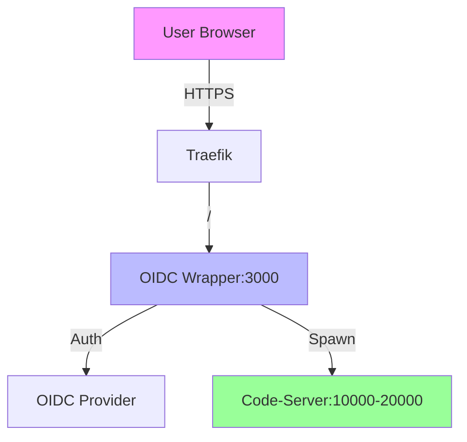

# OIDC Code-Server Wrapper Architecture

## Overview
A Go-based OIDC authentication wrapper for dynamically managing code-server instances per user.

## Architecture Components

### 1. Authentication Service
- **Package**: `internal/auth`
- **Purpose**: Handle OIDC authentication flow
- **Key Features**:
  - OIDC provider integration (Google, GitHub, etc.)
  - State parameter validation
  - Token exchange and validation
  - User profile extraction

### 2. Session Management
- **Package**: `internal/session`
- **Purpose**: In-memory user session management
- **Storage**: Thread-safe in-memory maps with mutexes
- **Structure**:
  ```go
  type MemoryStore struct {
      mu       sync.RWMutex
      sessions map[string]*SessionData
      users    map[string]*UserData
  }
  ```

### 3. Instance Manager
- **Package**: `internal/instance`
- **Purpose**: Dynamic code-server lifecycle management
- **Features**:
  - Port allocation (10000-20000 range)
  - Process spawning and monitoring
  - Health checks
  - Graceful shutdown

### 4. Reverse Proxy
- **Package**: `internal/proxy`
- **Purpose**: Route requests to user-specific code-server instances
- **Routing**:
  - `/~username/path` → `localhost:port/?folder=/home/username/path`
  - WebSocket support for terminal/IDE features

### 5. Configuration
- **Package**: `internal/config`
- **Source**: Environment variables only
- **Environment Variables**:
  ```bash
  # Required
  OIDC_CLIENT_ID=your-client-id
  OIDC_CLIENT_SECRET=your-client-secret
  OIDC_PROVIDER_URL=https://accounts.google.com
  OIDC_REDIRECT_URL=https://code.srvd.dev/auth/callback
  SESSION_SECRET=your-session-secret
  
  # Optional
  SERVER_HOST=0.0.0.0
  SERVER_PORT=3000
  CODE_SERVER_EXECUTABLE=/usr/bin/code-server
  CODE_SERVER_PORT_RANGE_START=10000
  CODE_SERVER_PORT_RANGE_END=20000
  CODE_SERVER_HOME_BASE=/home
  SESSION_TIMEOUT=3600
  LOGGING_LEVEL=info
  LOGGING_FORMAT=json
  ```

## API Endpoints

| Method | Path | Purpose |
|--------|------|---------|
| GET | `/` | Landing page with OIDC login |
| GET | `/auth/login` | Initiate OIDC flow |
| GET | `/auth/callback` | OIDC callback handler |
| GET | `/auth/logout` | Logout endpoint |
| GET | `/~:username/*` | Proxy to user's code-server |
| GET | `/health` | Health check |

## URL Routing Strategy

### External URL to Internal Mapping
```
https://code.srvd.dev/~alice/project1
    ↓
localhost:10001/?folder=/home/alice/project1
```

### Port Allocation
- Dynamic port assignment per user
- Port range: 10000-20000
- Port persistence during session
- Cleanup on session timeout

## Security Considerations

1. **Authentication**
   - OIDC state parameter validation
   - PKCE flow support
   - Secure session tokens

2. **Authorization**
   - Username-based access control
   - Path traversal prevention

3. **Session Security**
   - HTTP-only cookies
   - Secure flag for HTTPS
   - Session timeout

4. **Process Isolation**
   - User-specific code-server instances
   - Home directory isolation

## Deployment Architecture



## File Structure

```
oidc-code-server-wrapper/
├── cmd/wrapper/main.go          # Application entry point
├── internal/
│   ├── auth/oidc.go            # OIDC authentication
│   ├── config/config.go        # Configuration management
│   ├── instance/manager.go     # Code-server lifecycle
│   ├── proxy/reverse_proxy.go  # HTTP routing
│   ├── session/store.go        # In-memory storage
│   └── templates/landing.html  # Login page template
├── web/
│   ├── static/                 # CSS/JS assets
│   └── templates/              # HTML templates
├── .env                        # Environment variables template
├── Dockerfile                  # Container image
└── README.md                   # Documentation
```

## Dependencies

- **Fiber**: Web framework
- **goth**: OIDC/OAuth2 library
- **cobra**: CLI flags
- **zap**: Structured logging

## Environment Variables

```bash
# Required
OIDC_CLIENT_ID=your-client-id
OIDC_CLIENT_SECRET=your-client-secret
OIDC_PROVIDER_URL=https://accounts.google.com

# Optional
SERVER_HOST=0.0.0.0
SERVER_PORT=3000
CODE_SERVER_EXECUTABLE=/usr/bin/code-server
SESSION_SECRET=your-secret-key
```

## Health Checks

- **/health**: Application health
- **/health/ready**: Readiness probe
- **/health/live**: Liveness probe

## Monitoring

- Process monitoring for code-server instances
- Session metrics
- Authentication success/failure rates
- Resource usage tracking